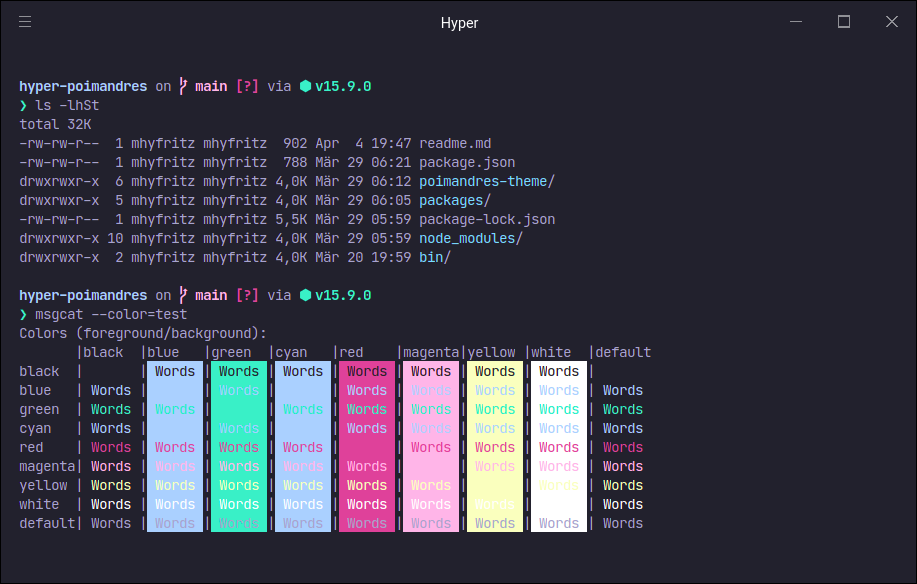

<div align="center">
  
  <h1>Poimandres</h1>
</div>

> Elegant [Hyper](https://hyper.is/) theme based on the [Poimandres VS Code theme](https://github.com/drcmda/poimandres-theme)

## Poimandres



### Install

```
$ hyper install hyper-poimandres
```

Alternatively, open `~/.hyper.js` and add `"hyper-poimandres"` to the `plugins` array.

## Poimandres Storm


### Install

```
$ hyper install hyper-poimandres-storm
```

Alternatively, open `~/.hyper.js` and add `"hyper-poimandres-storm"` to the `plugins` array.
